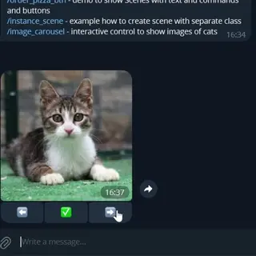

[](https://www.nuget.org/packages/Telegami/)
[](https://github.com/ihtfw/Telegami/actions/workflows/publish.yml)

Telegami is the modern library for building Telegram bots. The goal of Telegami is to keep things straightforward and easy to use.

Telegami is build on top of the [Telegram.Bot](https://github.com/TelegramBots/Telegram.Bot) library, which handles communication with the Telegram Bot API.

**Current status:** Active development — breaking changes may occur between releases.

# See in action

## Minimal example

```csharp
var serviceCollection = new ServiceCollection();
serviceCollection.AddTelegamiBot("BOT_TOKEN_FROM_BOT_FATHER");

var serviceProvider = serviceCollection.BuildServiceProvider();

var botsManager = serviceProvider.GetRequiredService<TelegamiBotsManager>();
var bot = botsManager.Get();

// Handle /start command
bot.Start(async ctx =>
{
    await ctx.ReplyAsync("Hello! I'm a bot. How can I help you?");
});

// Handle /custom command
bot.Command("custom", async ctx =>
{
    await ctx.ReplyAsync($"This is a custom command handler. Arguments: '{ctx.BotCommand!.Arguments}'");
});

await botsManager.LaunchAsync();
```

That's it! Bot is working and can handle **/start** and **/custom** commands.

## Other handlers and DI

```csharp
var serviceCollection = new ServiceCollection();
serviceCollection.AddScoped<MyCustomService>(); // <- our service
serviceCollection.AddTelegamiBot("BOT_TOKEN_FROM_BOT_FATHER");

var serviceProvider = serviceCollection.BuildServiceProvider();

var botsManager = serviceProvider.GetRequiredService<TelegamiBotsManager>();
var bot = botsManager.Get();

// We can ask for service from Scope in any handler!
bot.Start(async (MessageContext ctx, MyCustomService myService) => // <- our custom service
{
    await ctx.ReplyAsync("Hello! I'm a bot. How can I help you?");
});

// Handle only specific message types
bot.On(MessageType.Sticker, async (MessageContext ctx) => { await ctx.ReplyAsync($"What a nice sticker!"); });

// Common use case when we need to trigger on Text.Contains
bot.Hears("hello", async ctx => { await ctx.ReplyAsync("World!"); });

// Handle all messages
bot.On(async ctx => { await ctx.ReplyAsync("this will handle all messages"); });

await botsManager.LaunchAsync();
```

## Scenes

Scene is matched to user.id, chat.id and thread.id, so every user can have his own active Scene.
While user is on scene, all messages are handled by this Scene.
Also we can navigate from one Scene to another for more complex scenarios.

```csharp

// /person command so we can enter scene
bot.Command("person", async ctx => { await ctx.EnterSceneAsync("person_scene"); });

bot.AddScene("person_scene",
    new Scene()
        .Enter(async ctx => await ctx.SendAsync("Hi! What's your name?"))
        .Leave(async ctx =>
        {
            var person = ctx.Session.Get<Person>();

            await ctx.ReplyAsync($"Your name is {person.Name} {person.LastName}, you are {person.Age} years old.");
        })
        .On(MessageType.Text, async ctx =>
        {
            var person = ctx.Session.Get<Person>();

            if (string.IsNullOrEmpty(person.Name))
            {
                person.Name = ctx.Message.Text;
                ctx.Session.Set(person);
                await ctx.ReplyAsync($"What's your last name?");
                return;
            }

            if (string.IsNullOrEmpty(person.LastName))
            {
                person.LastName = ctx.Message.Text;
                ctx.Session.Set(person);
                await ctx.ReplyAsync($"What's your age?");
                return;
            }

            if (!int.TryParse(ctx.Message.Text, out var age))
            {
                await ctx.ReplyAsync($"Age should be a number!");
                return;
            }

            person.Age = age;
            await ctx.LeaveSceneAsync();
        }));
```

## WizardScenes

It's special type of scene where we can navigate. Let's check out same example with the person but in WizardScene.

```csharp

// /person_wizard command so we can enter scene

bot.Command("person_wizard", async ctx => { await ctx.EnterSceneAsync("person_wizard_scene"); });
bot.AddScene("person_wizard_scene", new WizardScene(async (MessageContext ctx, WizardContext wiz) =>
    {
        await ctx.SendAsync("Hi! What's your name?");
        wiz.Next();
    },
    async (MessageContext ctx, WizardContext<Person> wiz) =>
    {
        if (string.IsNullOrEmpty(ctx.Message.Text))
        {
            await ctx.SendAsync("Incorrect message, please send text");
            return;
        }

        wiz.State.Name = ctx.Message.Text;

        await ctx.SendAsync("Hi! What's your last name?");
        wiz.Next();
    },
    async (MessageContext ctx, WizardContext<Person> wiz) =>
    {
        if (string.IsNullOrEmpty(ctx.Message.Text))
        {
            await ctx.SendAsync("Incorrect message, please send text");
            return;
        }

        wiz.State.LastName = ctx.Message.Text;

        await ctx.SendAsync("Hi! What's your age?");
        wiz.Next();
    },
    async (MessageContext ctx, WizardContext<Person> wiz) =>
    {
        if (string.IsNullOrEmpty(ctx.Message.Text))
        {
            await ctx.SendAsync("Incorrect message, please send text");
            return;
        }

        if (!int.TryParse(ctx.Message.Text, out var age))
        {
            await ctx.SendAsync("Age should be a number!");
            return;
        }

        wiz.State.Age = age;

        await ctx.SendAsync($"Thank you! Your information is:\n{wiz.State}");
        await ctx.LeaveSceneAsync();
    }
));

class Person
{
    public string? Name { get; set; }
    public string? LastName { get; set; }
    public int? Age { get; set; }

    public override string ToString()
    {
        return $"Name: {Name}, LastName: {LastName}, Age: {Age}";
    }
}
```

## Scene can be used to create controls. See ImageCarouselScene example.



Check out [Wiki](https://github.com/ihtfw/Telegami/wiki) for more.

# Roadmap

## v1.0.0

- [ ] Stable code base
- [ ] Write tests
- [ ] Implement primitives, so it's easy to implement workflows
  - [ ] DatePicker
  - [ ] TODO what else?
- [ ] Write Wiki pages
- [ ] Write Examples
  - [x] ImageCarousel
- [ ] Implement Telegami.Sessions.Redis
- [ ] Implement Telegami.Sessions.Postgres
- [ ] Implement Telegami.Sessions.SqlServer
- [ ] Run demo bot and add link to readme
